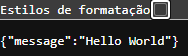
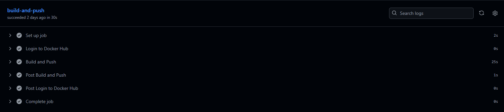
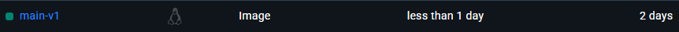
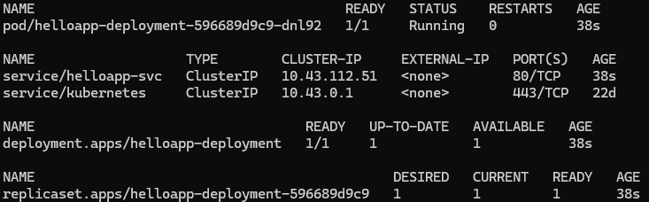
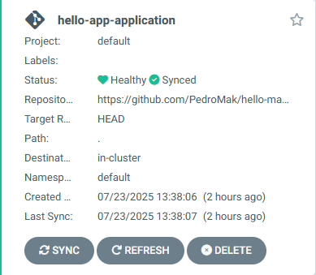
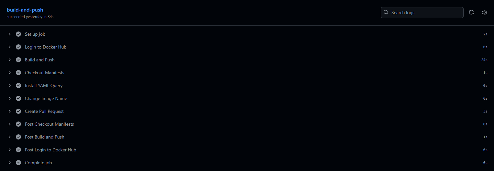
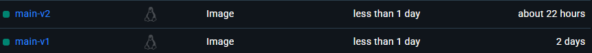

# CI/CD com GitHubs Actions

#### Pré-requisitos:
* Conta no GitHub; 
* Conta no Docker Hub com token de acesso; 
* Rancher Desktop com Kubernetes habilitado; 
* kubectl configurado corretamente;
* ArgoCD instalado no cluster local;  
* Git instalado;
* Python 3 e Docker instalados;

#### Serão criado dois repositórios: um repositório irá conter a aplicação FastAPI, o Dockerfile e o GitHub Actionc Workflow, já o outro irá conter os manifestos Kubernetes e ArgoCD.


## Repositório 1 - Aplicação FastAPI, Dockerfile e GitHub Actions Workflow:
* Para o estudo foi fornecida a simples aplicação [main.py](https://github.com/PedroMak/hello-app-CICD/blob/main/main.py) que retorna um `Hello World` na tela: </br>


* Foi então criado um [Dockerfile](https://github.com/PedroMak/hello-app-CICD/blob/main/Dockerfile) para criar uma imagem dessa aplicação.

* Em seguida criei a primeira parte de meu `workflow` que faz o build da imagem e faz o upload dela no DockerHub.

```
name: Build and Push Image to DockerHub

on: push

jobs:
  build-and-push:
    runs-on: ubuntu-latest
    steps:
      - name: Login to Docker Hub
        uses: docker/login-action@v3
        with:
          username: ${{ vars.DOCKERHUB_USERNAME }}
          password: ${{ secrets.DOCKERHUB_TOKEN }}

      - name: Build and Push
        uses: docker/build-push-action@v6
        with:
          push: true
          tags: ${{ vars.DOCKERHUB_USERNAME }}/hello-app:${{ github.ref_name }}-v${{ github.run_number }}
```

* Foram utilizadas duas `Actions` oficiais e mantidas pelo `Docker`, uma que fazer o login no DockerHub e outra que faz o build da imagem eseu upload;
* Para isso foi necessário a criação de um `secret` contendo um token de acesso gerado no DockerHub e uma `variable` contendo o meu nome de usuário no DockerHub;
* No parâmetro `tag` utilizei os `contexts` para nomeação dinâmica:
* Em `${{ vars.DOCKERHUB_USERNAME }}/hello-app:${{ github.ref_name }}-v${{ github.run_number }}`
  * `vars.DOCKERHUB_USERNAME` pega meu nome de usuário que com `/hello-app` forma o nome do repositório no DockerHub;
  * `github.ref_name` pega o nome da branch onde foi feito o `commit`;
  * `github.run_number` pega o número da execução desse workflow;
  * No final junto os dois com `-v` no meio para dar um nome para a tag, resultando em algo como `main-v1`, `main-v2` e assim por diante.
* Ao rodar esse `workflow` todas as etapas foram devidamente executadas:</br>

* E o DockerHub agora contém uma imagem com a tag `main-v1`:</br>


## Repositório 2 - Manifestos Kubernetes e ArgoCD:
* Para armazenar os manifestos Kubernetes e ArgoCD foi criado o seguinte repositório: [hello-manifests-CICD](https://github.com/PedroMak/hello-manifests-CICD).
* Foram criados:
  * Um manifesto de um `service` do tipo `ClusterIP`, que será acessado posteriormente via `port-forward`;
  * Um manifesto de um `deployment` com uma réplica e com a imagem da aplicação no DockerHub;
  * O manifesto da aplicação ArgoCD que estará observando este mesmo repositório e aplicando as alterações no meu cluster local.
* Para verificar o funcionamento, dentro do diretório onde o manifesto ArgoCD se encontra, rodamos `kubectl apply -f <nome_do_arquivo>.yaml`:
  * Ao rodar `kubectl get all` podemos visualizar que os componente foram criados:</br>
  
  * Se acessarmos o ArgoCD iremos visualizar também a aplicação criada sua UI:</br>
  

# Repositório 1: GitHub Actions Workflow - criação de Pull Request:
#### De volta ao Workflow, iremos expandí-lo para que, após o build e push da imagem para o DockerHub, ele também crie um `pull request` que altera a tag da imagem utilizada no manifesto de `deployment`.
* Primeiro criei um `PAT` (Personal Access Token) e o adicionei como um `secret` no Repositório 1 para que ele possa ter acesso ao Repositório 2.
* Em seguida adicionei o seguinte trecho ao Workflow:
```
- name: Checkout Manifests
    uses: actions/checkout@v4
    with:
      repository: PedroMak/hello-manifests-CICD
      token: ${{ secrets.PERSONAL_ACCESS_TOKEN }}
      path: manifests
```
* Nesse trecho é utilizada uma `action` oficial do GitHub para clonar o repositório `hello-manifests-CICD` para o diretório `manifests` no Runner.
* Em seguida adicionei o seguinte trecho:
```
- name: Install YAML Query
    run: |
      sudo wget https://github.com/mikefarah/yq/releases/latest/download/yq_linux_amd64 -O /usr/bin/yq
      sudo chmod +x /usr/bin/yq
```
* Nesse trecho é feito o download do binário pré-compilado do `yq` e é dada a permissão de execução.
* Em seguida adicionei o seguinte trecho:
```
- name: Change Image Name
    env:
      IMAGE_TAG: ${{ vars.DOCKERHUB_USERNAME }}/hello-app:${{ github.ref_name }}-v${{ github.run_number }}
    run: |
      yq eval -i ".spec.template.spec.containers[0].image = \"$IMAGE_TAG\"" manifests/helloapp-deployment.yaml
```
* Nesse trecho eu armazeno o que será o nome da imagem com a tag atualizada numa variável `IMAGE_TAG` e passo ela no comando `yq` que troca o valor antigo da chave `image` do manifesto pelo valor novo, contido na variável `IMAGE_TAG`.
* Por fim, adicionei o seguinte trecho:
```
- name: Create Pull Request
    uses: peter-evans/create-pull-request@v6
    with:
      token: ${{ secrets.PERSONAL_ACCESS_TOKEN }}
      path: manifests
      branch: update/new-image
      title: "Update image to a new tag"
      commit-message: "update: updating image tag"
```
* Esse trecho utiliza uma `action` bem avaliada e amplamente utilizada para criar um `pull request` no Repositório 2.
* Ao fazer o push dessas atualizações, o workflow foi executado devidamente:</br>

* E a imagem no DockerHub agora possui duas tags:</br>

> [!NOTE]
> Essas tags foram geradas apenas para fins de teste, a aplicação em si ainda não foi alterada.

